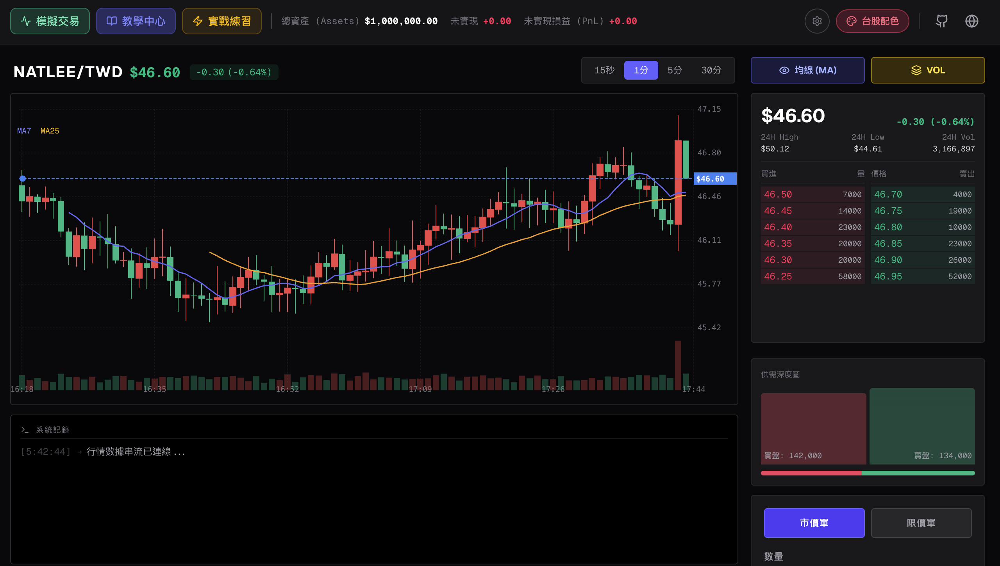
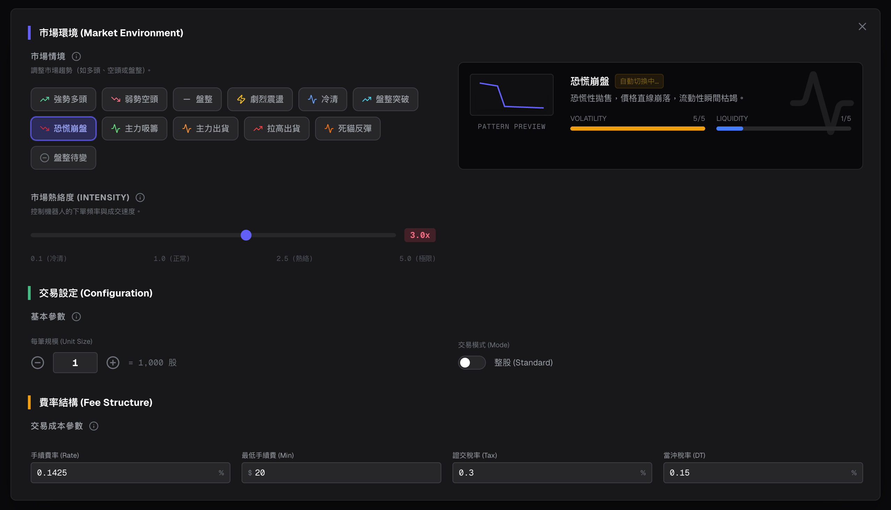
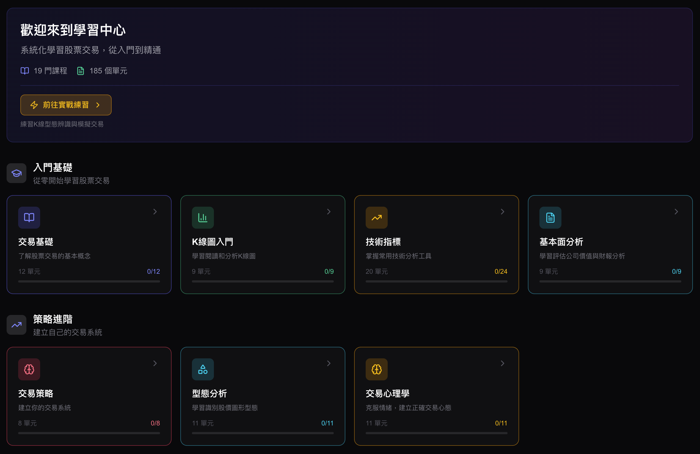
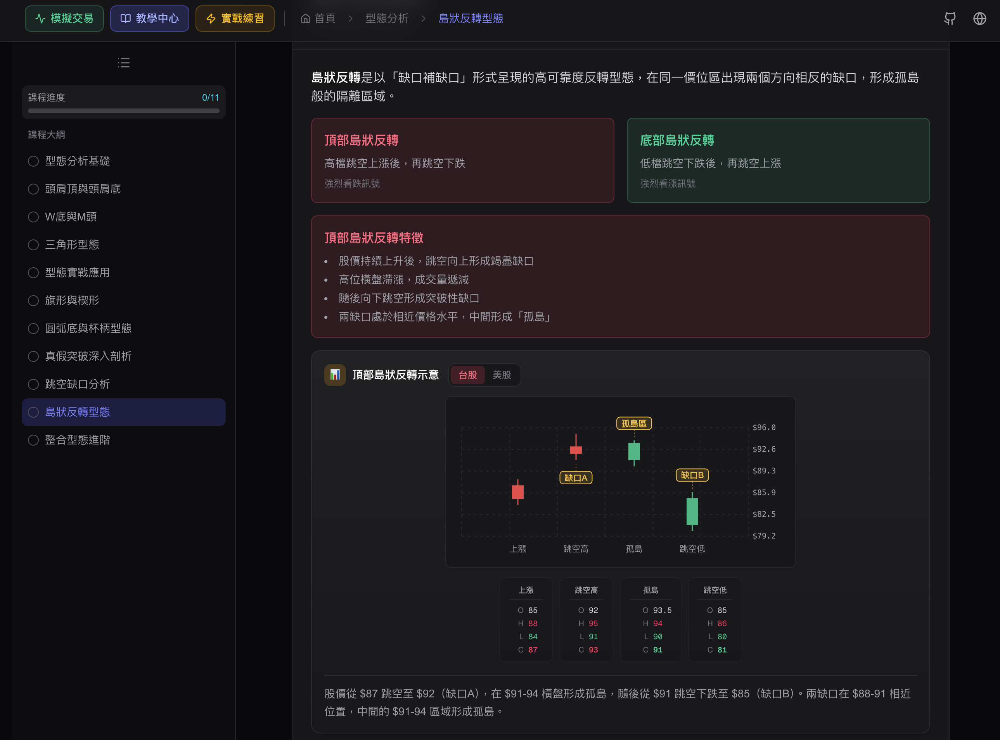
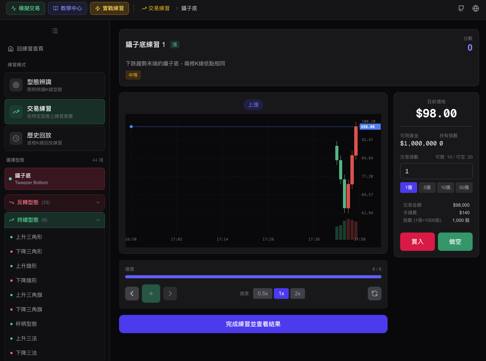
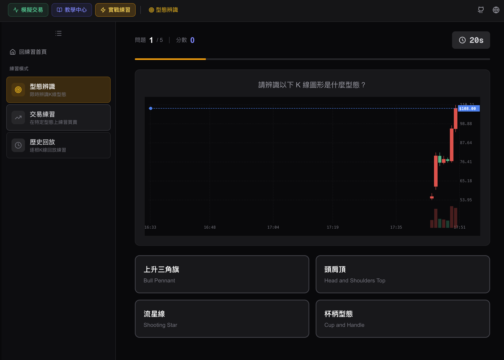

[English](README.md)

# 股票交易模擬器


*主交易介面，包含即時訂單簿、K線圖表與交易面板*

一個功能完整的股票交易模擬器，使用 Next.js 建構，具備即時撮合引擎、機器人驅動的市場模擬，以及整合式的交易學習中心。

## 功能特色

### 交易模擬

- **撮合引擎**：價格-時間優先順序撮合
- **訂單類型**：市價單、限價單
- **訂單條件**：GTC（委託至取消）、IOC（立即成交否則取消）、FOK（全部成交否則取消）
- **訂單簿**：即時買賣五檔顯示
- **K線圖表**：支援多時間週期（15秒、1分鐘、5分鐘、30分鐘），含移動平均線與成交量
- **24小時統計**：最高價、最低價、成交量、漲跌幅
- **持倉管理**：分批次追蹤持倉與損益計算
- **交易紀錄**：完整的成交歷史記錄


*市場情境配置與機器人設定*

### 機器人市場模擬

三種類型的機器人模擬真實市場活動：

- **MarketMakerBot（造市商機器人）**：在買賣雙方提供流動性報價
- **TrendBot（趨勢機器人）**：追蹤市場趨勢並產生方向性壓力
- **NoiseBot（雜訊機器人）**：模擬散戶的隨機交易行為

**市場情境預設**：
- 多頭市場 - 較高波動度，向上偏移
- 空頭市場 - 較高波動度，向下偏移
- 盤整市場 - 低波動度，高流動性
- 劇烈波動 - 極端的價格震盪
- 平靜市場 - 最小波動，極高流動性

### 學習中心

4 大類別共 19 門課程：

| 類別 | 課程 |
|------|------|
| **入門基礎** | 交易基礎、K線圖入門、技術指標、基本面分析 |
| **策略進階** | 交易策略、風險管理、K線型態、交易心理學 |
| **專業技巧** | 當沖交易、籌碼分析、交易情境、選股技巧、選擇權、產業分析 |
| **投資理財** | ETF 投資、股息投資、投資組合、美股投資入門、台美市場比較 |

提供互動式測驗、視覺化圖表與進度追蹤功能。


*互動式學習中心，提供 4 大類別共 19 門課程*


*詳細課程內容，包含視覺化圖表與互動式測驗*

### 練習中心

掌握 K 線型態與磨練交易執行的綜合訓練環境：

- **型態辨識**：互動式測驗模式，學習識別真實市場情境中的 K 線型態（如頭肩頂、楔形、三角形等）。
- **交易練習**：零風險的模擬環境，針對特定型態或隨機情境進行練習交易。
- **倒帶回放**：檢視歷史價格走勢並重播特定情境，分析決策過程。


*K線型態辨識練習，搭配K線圖表*


*互動式測驗模式，學習識別圖表型態*

### 市場分析

即時市場情報：

- **趨勢分析**：偵測市場方向（多頭/空頭）與強度。
- **委託簿掃描**：分析買賣盤壓力以評估市場情緒。
- **動能指標**：追蹤 RSI 與成交量速度。
- **型態偵測**：自動識別正在形成的 K 線型態並提供信心分數。

### 其他特色

- **台股價格跳動規則**：符合實際的價格檔位設定
- **漲跌色彩切換**：亞洲模式（紅漲綠跌）vs 西方模式（綠漲紅跌）
- **整股/零股交易模式**
- **可調整的手續費率**
- **市場活躍度控制**

## 技術棧

- **框架**：[Next.js](https://nextjs.org/) 16.1.6（App Router）
- **UI 函式庫**：[React](https://react.dev/) 19.2.3
- **程式語言**：[TypeScript](https://www.typescriptlang.org/)
- **樣式**：[Tailwind CSS](https://tailwindcss.com/) 4
- **圖示**：[Lucide React](https://lucide.dev/)

## 快速開始

### 環境需求

- Node.js 18.x 或更新版本

### 安裝步驟

```bash
# 複製專案
git clone https://github.com/your-username/stock-trading-simulation.git

# 進入專案目錄
cd stock-trading-simulation

# 安裝相依套件
npm install
```

### 開發指令

```bash
# 啟動開發伺服器
npm run dev

# 建構正式版本
npm run build

# 啟動正式伺服器
npm start

# 執行程式碼檢查
npm run lint
```

開啟 [http://localhost:3000](http://localhost:3000) 檢視交易模擬器。

## 專案結構

```
src/
├── app/                    # Next.js App Router 頁面
│   ├── page.tsx           # 主交易介面
│   └── learn/             # 學習中心
├── components/
│   ├── trading/           # 交易 UI 元件
│   │   ├── order/         # 下單表單元件
│   │   ├── orderbook/     # 訂單簿顯示
│   │   ├── holdings/      # 持倉管理
│   │   └── records/       # 交易紀錄
│   ├── chart/             # K線圖表
│   ├── learn/             # 學習中心元件
│   └── ui/                # 可重用 UI 元件
├── hooks/
│   ├── useMarketSimulator.ts  # 主模擬協調器
│   ├── usePriceEngine.ts      # 價格產生
│   └── useTradingEngine.ts    # 交易狀態管理
├── lib/
│   ├── matching/          # 核心撮合引擎
│   │   ├── MatchingEngine.ts  # 訂單撮合邏輯
│   │   ├── OrderBook.ts       # 價格-時間優先順序簿
│   │   └── CandleAggregator.ts # K線產生
│   └── bots/              # 交易機器人
│       ├── BotManager.ts      # 機器人協調器
│       ├── MarketMakerBot.ts  # 流動性提供者
│       ├── TrendBot.ts        # 趨勢追蹤者
│       └── NoiseBot.ts        # 隨機交易者
├── data/learn/            # 課程內容（JSON）
├── constants/             # 設定檔
└── types/                 # TypeScript 型別定義
```

## 架構說明

### 訂單流程

```
使用者/機器人訂單 → MatchingEngine → OrderBook
                        ↓
                價格-時間優先撮合
                        ↓
                    成交執行
                        ↓
                CandleAggregator → 圖表更新
                        ↓
                  狀態更新 → UI 渲染
```

### 撮合引擎

- 實作價格-時間優先順序撮合
- 支援部分成交
- 市價單可消耗多個價格檔位
- 套用台股價格跳動規則

### 機器人系統

`BotManager` 在每個 tick（預設 100ms）協調所有機器人：

1. **MarketMakerBot** 在多個價格檔位更新報價
2. **TrendBot** 分析價格歷史並下達方向性訂單
3. **NoiseBot** 隨機提交市價單/限價單

訂單數量會根據可設定的 `unitSize`（單位大小）和 `intensity`（強度）參數進行縮放。

## 貢獻者

- [NatLee](https://github.com/NatLee)


